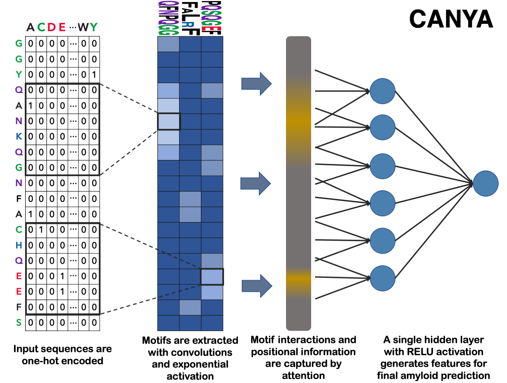

## CANYA a neural net to predict nucleation propensity

CANYA is a hybrid neural network that was trained on 100,000 random peptides to predict their nucleation status in a massively parallel experiment of nucleation rates. We include here the package and technical details for setting up and running CANYA on your own sequences. Please see [biorxiv link] for further information.

### Installation
To start, you'll need a python installation with tensorflow, numpy, and pandas installed. If you don't have these, CANYA will attempt to install the respective packages (and versions) with which it was developed. In this case, we recommend using a blank virtual environment or conda environment and installing CANYA from there.

e.g. by conda:
```
conda create canya_env
conda activate canya_env
```

CANYA can then be installed via pip:
```
python -m pip install --no-cache-dir https://github.com/mj-thompson/canya/tarball/master
```

### Running CANYA